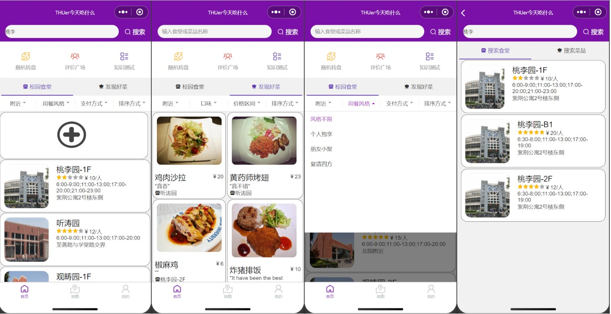
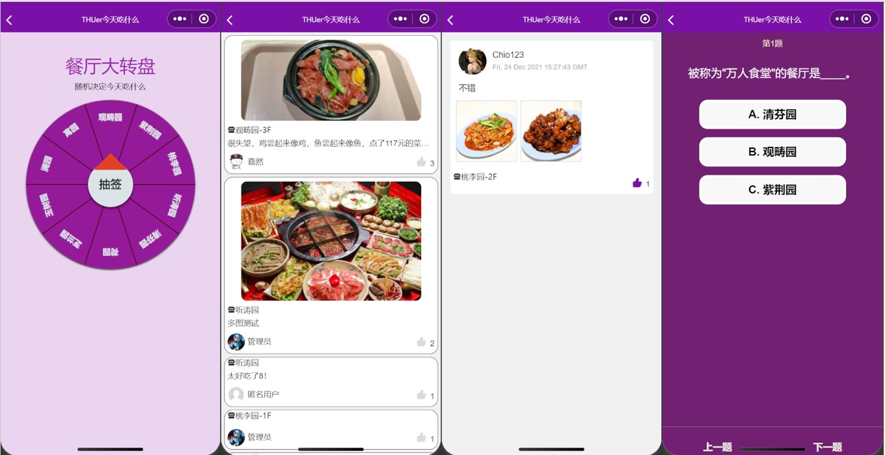
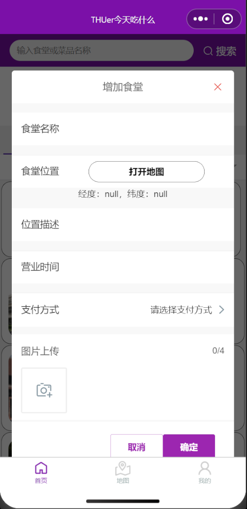
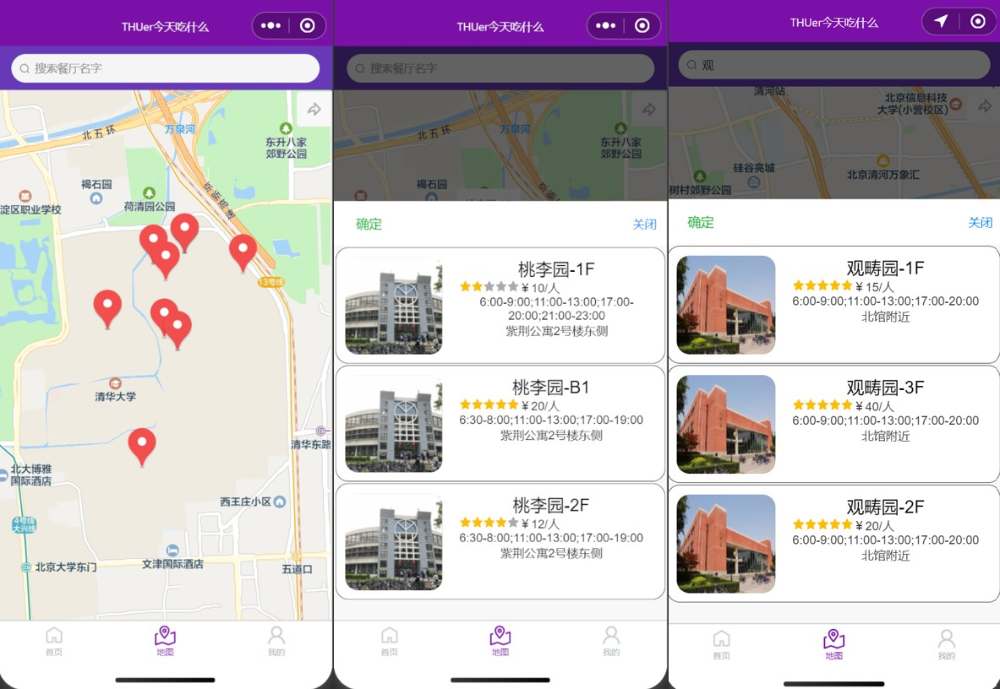
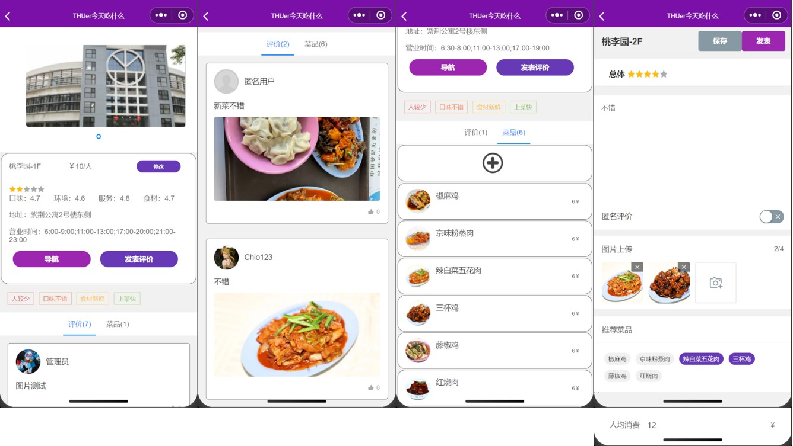
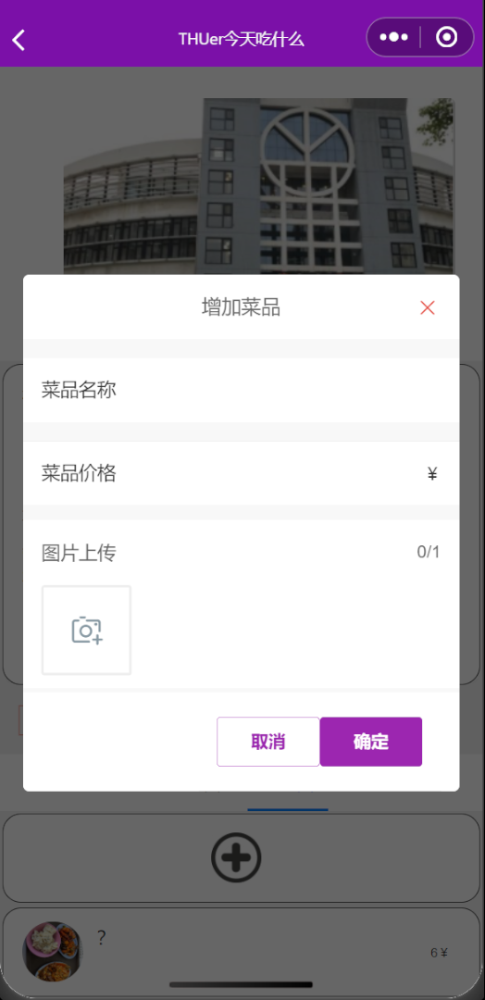
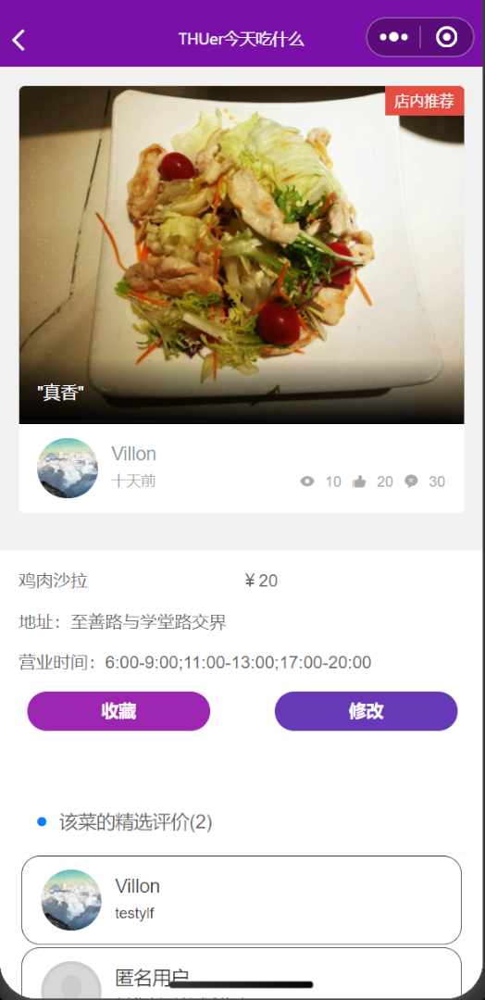
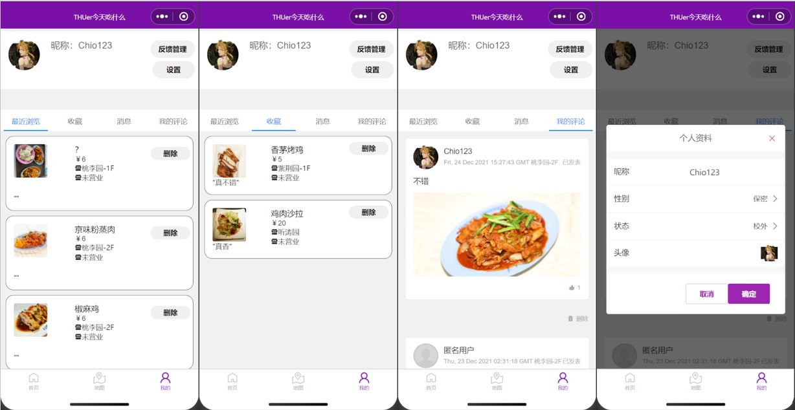
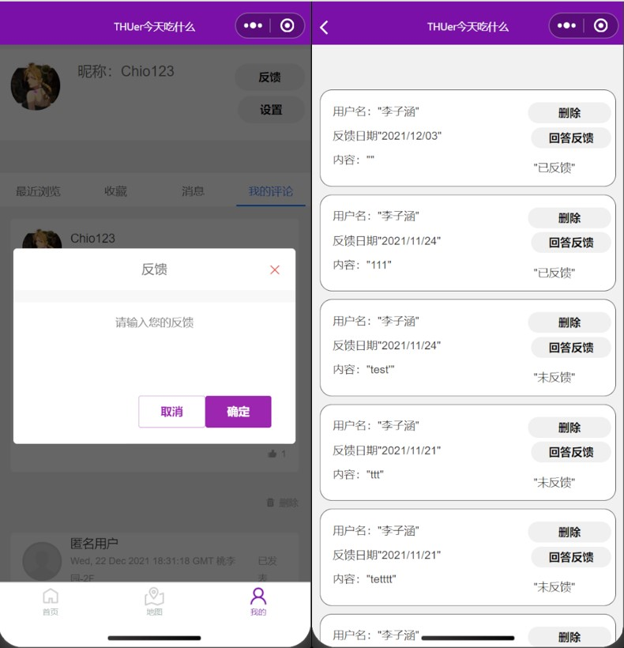

前端交互设计

1. **首页**

   在首页，用户可以使用以下功能：

   * **浏览信息**

     ​		首页可以浏览餐厅和菜品的信息，下拉页面到最底端时会刷新更多的餐厅/菜品信息，点击餐厅/菜品预览框可以跳转到对应的页面。

   * **筛选信息**

     ​		用户可在浏览餐厅/菜品信息时自定义筛选条件和排序方式，在选定筛选条件后页面会刷新并显示筛选结果。

   * **搜索信息**

     ​		用户可以在页面顶部搜索框搜索餐厅/菜品，点击搜索结果可跳转到对应页面。系统会记录用户的历史搜索记录，方便用户回看。

     

   * **趣味功能**

     ​		首页提供了进入随机转盘、评论广场、知识测试三个趣味功能的入口。随机转盘可以产生随机推荐食堂和菜品帮助用户解决选择困难；评论广场可以浏览最近用户发表的一些评论，点击评论会进入评论详情页面，在该页面可以对评论点赞以及跳转到评论对应的餐厅，此外若某条评论包含多张图片，在该评论详情页面可以查看全部图片；知识测试中包含一些对清华食堂知识的试题以便用户更加了解清华食堂文化。

     

   * **添加食堂**

     该功能仅管理员用户可使用。点击食堂信息展示中的“+”号框弹出新增食堂表单，填写对应信息后即可新增食堂。

     

2. **地图页面**

   在地图页面，用户可以使用以下功能：

   * **查看附近餐厅**

     ​		地图上的标记点展示了所有餐厅位置，点击气泡会弹出餐厅预览信息，点击可跳转到对应餐厅页面。点击地图右上角“返回”按钮可以让地图中心回到用户位置。

   * **搜索餐厅**

     ​		用户可以在上方搜索框搜索餐厅，搜索结果会以与点击气泡时弹出的底部模态框一致。

     

3. **餐厅页面**

   在餐厅页面，用户可以使用以下功能

   * **查看评论**

     ​		该页面按时间展示所有用户评论，点击某一条评论可查看评论详情，评论详情页面与首页”评论广场“中对应页面一致。

   * **查看菜品**

     ​		该页面展示了该食堂所有被收录的菜品，用户可以在食堂页面预览菜品的图片和价格，点击某个菜品会跳转到对应的菜品页面。

   * **导航**

     ​		点击导航按钮可显示用户当前位置和食堂的位置，可以跳转到手机其它地图APP进行导航。

   * **发表评论**

     ​		点击发表评论按钮可跳转到评论编辑页面，用户的评论中可以包含：星级，评论内容，是否匿名，图片，推荐菜品，人均价格；用户可以选择保存评论或者发表评论，保存的评论将只有用户自己可见（在”我的“页面中显示），发表的评论则所有用户可见。

     

   * **修改食堂信息**

     ​		该功能仅管理员用户可使用。点击”修改“按钮后可在弹出的表单中修改食堂信息。

   * **添加菜品**

     ​		该功能仅管理员用户可使用。点击菜品预览框最顶端的“+”号框弹出新增菜品表单，填写对应信息后即可对当前食堂新增菜品。

     

4. **菜品页面**

   在菜品页面，用户可以使用以下功能

   * **查看评论**

     ​		该页面显示了“推荐菜品”中包含该菜品的评论，另外在最顶端会显示精选评论以及发表时间。

   * **收藏菜品**

     ​		点击“收藏”可收藏该菜品，收藏的菜品将在“我的页面“中显示。

     

   * **修改菜品信息**

     ​		该功能仅管理用户可使用。点击”修改“按钮可在弹出的表单中修改菜品信息。

5. **我的页面**

   在我的页面，用户可以使用以下功能

   * **查看最近浏览及收藏**

     ​		用户可以在我的页面查看最近浏览和已收藏的菜品，并可点击删除按钮删除这些记录。

   * **查看消息**

     ​		用户可在我的页面查看管理员对自己反馈的回复

   * **编辑评论**

     ​		用户可在我的页面查看自己发表的所有评论，点击某条评论可对其进行编辑，对于保存但未发表的评论也可通过评论编辑页面对其进行发表，点击某条评论右下角的删除按钮可删除该条评论。

   * **修改个人设置**

     ​		点击设置可修改用户个人设置，可修改的包括昵称、性别、是否在校内、头像。

     

   * **提交反馈**

     ​		该功能仅非管理员可使用。点击”反馈“按钮（管理员用户页面该位置为“处理反馈”按钮）可向管理员反馈内容。

   * **处理反馈**

     ​		该功能仅管理员可使用。点击“处理反馈“按钮可处理用户的反馈。

     